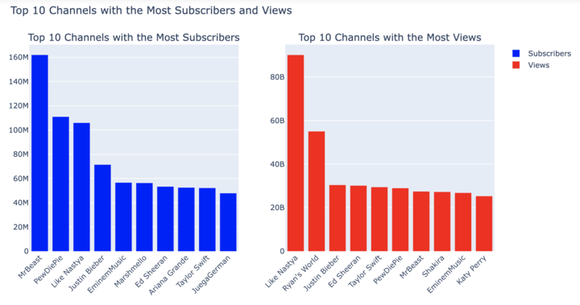
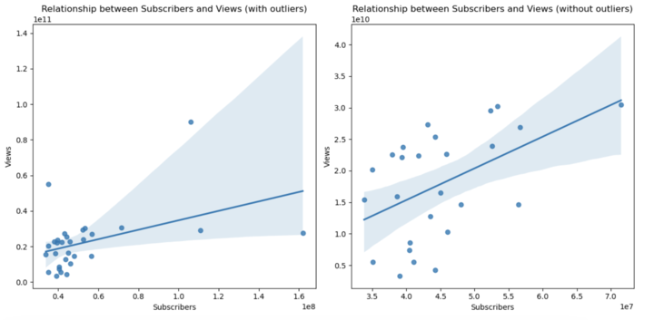
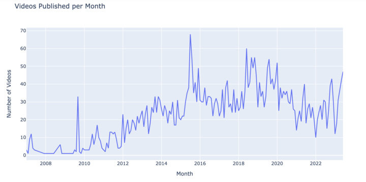
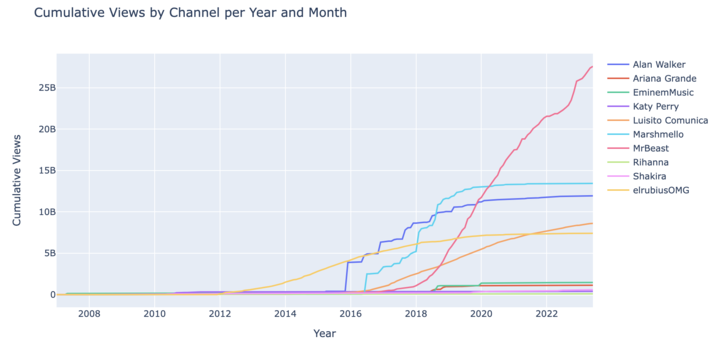
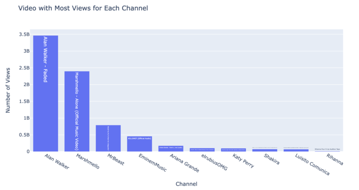
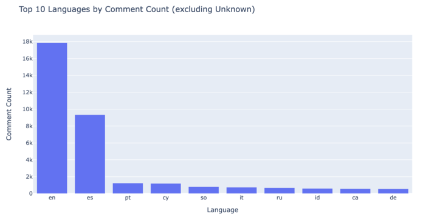
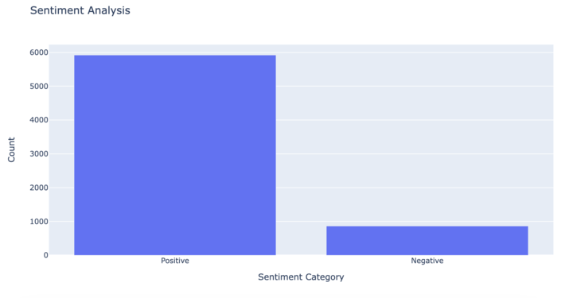
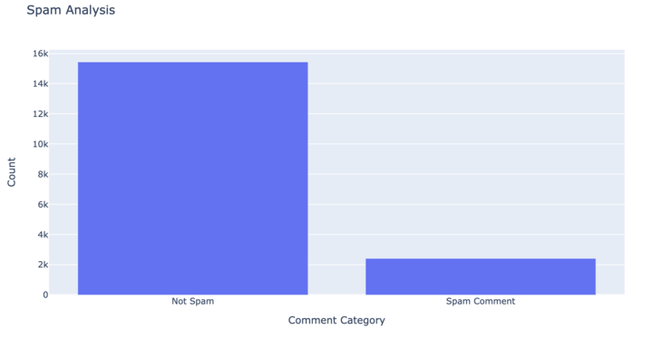
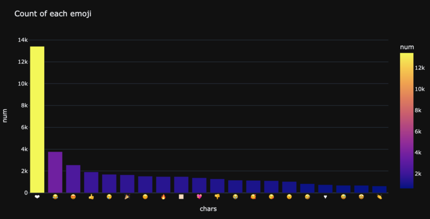

# Youtube-API-Analysis

### Project Goal:
The idea of this project is to connect to the Youtube API to get relevant information about channels and videos and to analyze the collected information.

### Section 1
I got information about 30 most relevant channels in Youtube, getting stats such as Views, Subscribers and Total Videos

In the exploratory analysis of this information we can see that Mr Beast is the channel with the most Subscribers whereas Like Nastya is the channel with the most views. 

We can also confirm that the features Subscriptors and Views are positevely correlated, meaning that when the amount of subscribers of a channel increases, the amount of views of the channel also increases.

### Section 2 and 3
In the next sections of the project, I took a sample of 10 channels used in the previous section to get all the video ids of them. Then, I collected information of each of those video ids.

From that information, we can conclude that the number of videos published in those channels started in early 2007 and it was not until 2012 when it started to raise mostly because of the uploads from ElRubius. This positive tendendecy had it peak on July 2015 when 68 videos were published and it continued until the early 2020 when the amount of videos published dropped as a consecuence of the pandemic and the irruption of Twitch.

Besides, we can see a comparison between the cumulative views that each of the channels has. We can see that Br Beast is by far the most viewed channel, being 2017 and 2018 the years where this channel exponentially grew in views reaching at the moment of doing this, an impressive amount of 27 Billion total views. It almost doubles the second most viewed channel of this list which is Marshmello.

Also, we can see a comparison between the most viewed video from each of the channels. We can see that Alan Walker video 'Faded' and Marshmello video 'Alone' are the most viewed videos with around 3 and 2 times of views respectevely than the third in the list.

## Section 4
In this section, I analize the comments made to the videos. In order to have a reasonable good performance, I took the 100 most seen videos from each of the 10 channels I took before and obtained 50 comments from each of these videos, making my new dataset of around 50K comments.

First, I analyzed the language of the comments. Using the library langdetect and excluding comments of less than one word, I could see that English is the most used language, almost doubling the second that is Spanish. As third, it appears the Portuguese.

The next step was to analyze the sentiment of the comments. I stayed only with the english comments and I used the textblob library, that gives a value from -1(completely negative) to 1(completely positive). I took comments from -0.25 to -1 as negatives and 0.25 to 1 as positives, being the rest neutral. Analyzing only positive and negatives comments we can see that 87% of the comments were positives and 13% were negatives.

The next step was to do a Spam Detection of the comments collected. I used the Bernoulli model trained with 5 datasets that cointain information about comments and their yes or no spam column. The result show that 13.5% of the comments were labeled as Spam.

Finally, I analyzed the usage of emojis in the comments using the emojis library. The result shows that the 'hearth' is by far the most used emoji.

That concludes this project.

* information collected on 22/06/2023
